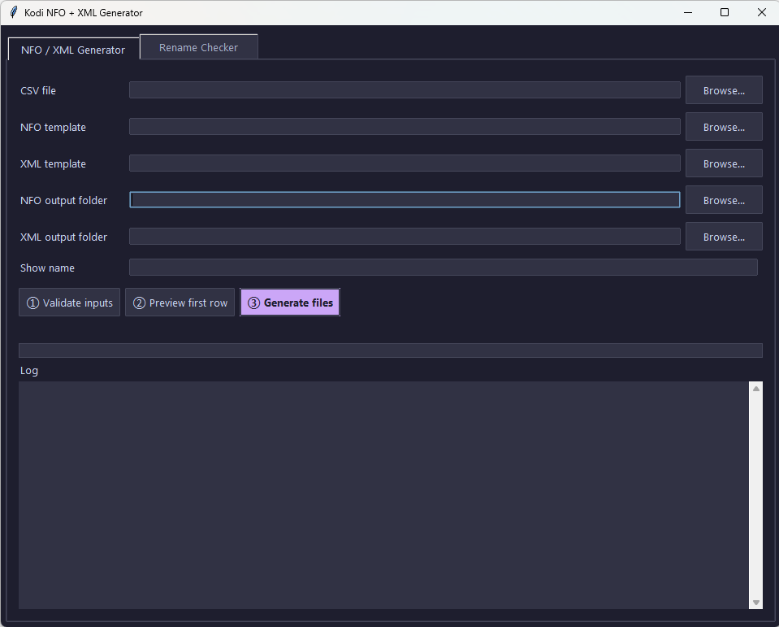
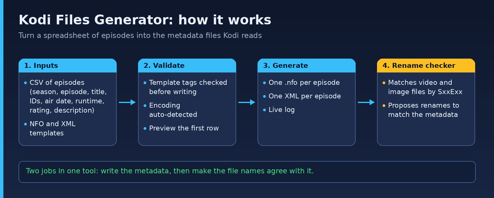

# Kodi Files Generator

**Generate Kodi episode `.nfo` and XML metadata files from a CSV, then check and rename episode files to match.**

[](LICENSE)  [](https://github.com/junqueirach/kodi-files-generator/actions/workflows/ci.yml)

<p align="center"></p>

**Download for Windows:** get the ready-to-run `.exe` from the [latest release](https://github.com/junqueirach/kodi-files-generator/releases/latest). No Python needed.

> **Windows SmartScreen:** the file is not code-signed, so Windows may show "Windows protected your PC". Click **More info**, then **Run anyway**. You can also run the app from source (see Quick start) and read every line of the code first.

## How it works

<p align="center"></p>

## What it does

- Reads a CSV of episodes (ID, season, episode, title, TVDB and IMDB IDs, air date, runtime, rating, description)
- Writes matching `.nfo` and XML files from editable templates
- Checks that templates contain every required tag before writing
- **Rename checker** that matches video and image files by `SxxExx` pattern and proposes renames
- Auto-detects file encoding
- Dark GUI (Catppuccin Mocha palette) with a live log

## Quick start

```
python kodi_generator.py
```

Standard library only (Tkinter). Five revisions are kept in `archive/versions/`. Planned improvements are in [docs/todo.txt](docs/todo.txt).

---

## How this was built

Built with **Claude (Anthropic)** as the coding partner. I wrote the requirements and the revision prompts, tested every build on real data, and decided what to fix next. The `archive/versions/` folder keeps every earlier release so the iteration history is visible.

**Security note:** the app stores any API keys you enter in a local settings file outside this repository. `.gitignore` excludes config and settings files so keys are never committed.

## Contributing and security

See [CONTRIBUTING.md](CONTRIBUTING.md) and [SECURITY.md](SECURITY.md). Bug reports and ideas are welcome through the issue templates.

## Licence

MIT. See [LICENSE](LICENSE).

## Author

Luiz Junqueira - [junqueira.ch](https://www.junqueira.ch) - [LinkedIn](https://www.linkedin.com/in/luizjunqueira/)
